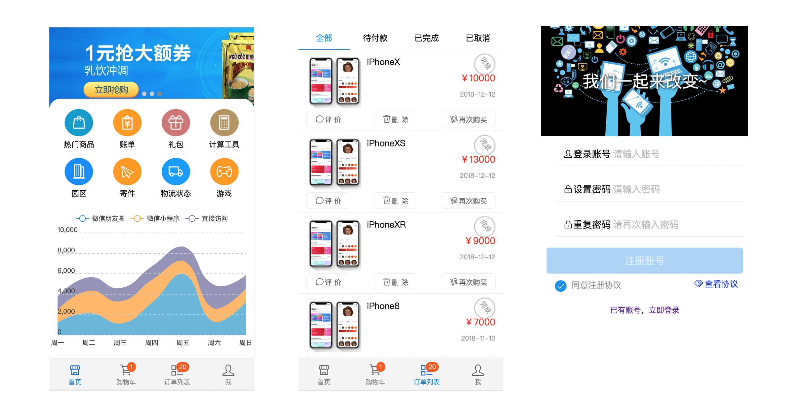
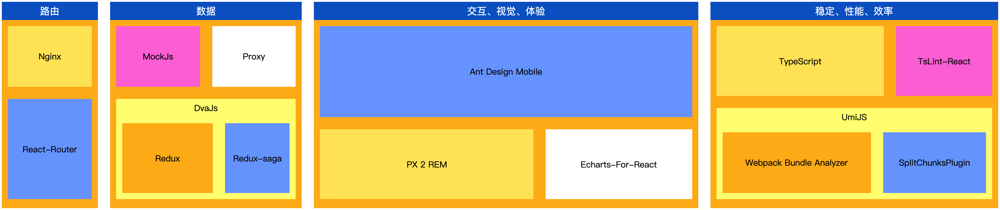
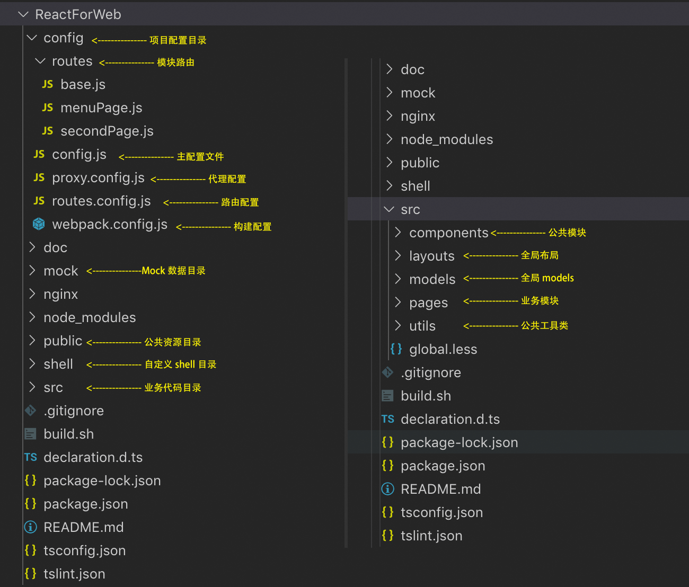

### **开始前，请花几分钟了解以下信息**

---

```1、项目起步```  ```2、依赖安装```  ```3、启动本地项目```  ```4、构建生产文件```

```5、shell命令示例```  ```6、参考文档```  ```7、一分钟科普```  ```8、Dva使用示例```

---

* 脚手架默认效果 PC版=>[点击可查看ReactForWeb](https://github.com/vaotoo/ReactForWeb)



```默认效果及功能``` 首页效果、菜单栏页、锚点页、列表页、数据可视化、二级页面、数据交互

---

* 架构概况



---

* 目录说明



---

* 1、项目起步

    * 环境说明
    
        * NPM（国内建议使用淘宝镜像）NodeJs > 7.x

        * 每次安装设置（临时使用）

            `npm i --registry=https://registry.npm.taobao.org`

            `npm i yourPackageName --registry=https://registry.npm.taobao.org`

        * 全局安装设置（长期使用）

            `npm config set registry https://registry.npm.taobao.org`

        * 查看npm源地址

            `npm config get registry`


* 2、依赖安装

    * npm install


* 3、启动本地项目

    * npm start


* 4、构建生产文件

    * npm run build


* 5、shell命令示例

    * 启动项目 ```sh shell/start.sh```

    * 启用代理 ```sh shell/proxy.sh```

    * 清除缓存 ```sh shell/removeCache.sh```


* 6、参考文档

    * ```React + Dva + Antd + Umi```

    * [React](https://reactjs.org/)

    * [React Router](http://react-guide.github.io/react-router-cn/index.html)

    * [DvaJs](https://dvajs.com/guide/introduce-class.html)

    * [Redux](https://www.redux.org.cn/)

    * [Redux-saga](https://redux-saga-in-chinese.js.org/)

    * [AntDesign](https://ant.design/)

    * [UmiJs](https://umijs.org/zh/guide/)

    * [TypeScript](https://www.tslang.cn/)

    * [TSConfig](https://www.tslang.cn/docs/handbook/tsconfig-json.html)

    * [TSLint](https://palantir.github.io/tslint/usage/configuration/)

    * [TSLint-React](https://www.npmjs.com/package/tslint-react)


* 7、一分钟科普

    * **React**

        React是一个为数据提供渲染为HTML视图的开源JavaScript 库。React视图通常采用包含以自定义HTML标记规定的其他组件的组件渲染。React为程序员提供了一种子组件不能直接影响外层组件的模型，数据改变时对HTML文档的有效更新，和现代单页应用中组件之间干净的分离。

    * **React-Router**

        React Router 是一个基于 React 之上的强大路由库，它可以让你向应用中快速地添加视图和数据流，同时保持页面与URL间的同步。

    * **Dva**

        Dva首先是一个基于 redux 和 redux-saga 的数据流方案，然后为了简化开发体验，dva 还额外内置了react-router 和 fetch，所以也可以理解为一个轻量级的应用框架。

    * **Redux**

        Redux 是 JavaScript 状态容器，提供可预测化的状态管理。可以让你构建一致化的应用，运行于不同的环境（客户端、服务器、原生应用），并且易于测试。

    * **Redux-saga**

        Redux-saga 是一个用于管理应用程序 Side Effect（副作用，例如异步获取数据，访问浏览器缓存等）的 library，它的目标是让副作用管理更容易，执行更高效，测试更简单，在处理故障时更容易。

    * **TypeScript**

        TypeScript是一种由微软开发的自由和开源的编程语言。它是JavaScript的一个严格超集，并添加了可选的静态类型和基于类的面向对象编程。C#的首席架构师以及Delphi和Turbo Pascal的创始人安德斯·海尔斯伯格参与了TypeScript的开发。

    * **Ant Design**

        Ant Design是阿里巴巴（蚂蚁金服体验技术部）经过大量的项目实践和总结，逐步打磨出一个服务于企业级产品的设计体系。基于『确定』和『自然』的设计价值观，通过模块化的解决方案，降低冗余的生产成本，让设计者专注于更好的用户体验。

    * **UmiJs**

        Umi 是阿里巴巴蚂蚁金服的底层前端框架，是一个可插拔的企业级 react 应用框架。Umi 以路由为基础的，支持类 next.js 的约定式路由，以及各种进阶的路由功能，并以此进行功能扩展，比如支持路由级的按需加载。然后配以完善的插件体系，覆盖从源码到构建产物的每个生命周期，支持各种功能扩展和业务需求，目前内外部加起来已有 50+ 的插件。


* 8、Dva使用示例

    请参考[ReactForWeb中的说明](https://github.com/vaotoo/ReactForWeb)


```注意``` models/global.ts为全局数据，如非必要请勿加入过多数据，页面级数据请参照pages/menuExample中的示例
